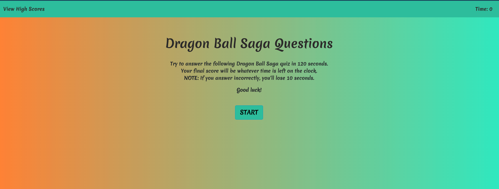

**Version 1.0**

Homework #4
A quiz that determines the score based on the time left on the clock.  

---

## Dragon Ball Quiz 

Contributors
Jonathan Echevarria j.eche589@gmail.com

## How to deploy
Open quiz by going to https://jdavila10.github.io/DB_Quiz/

## How to take the quiz
-- You will first be presented with a main screen that will briefly explain the rules and how the score is determined

-- Click the Start button to start the quiz
-- Answer the questions. Note: The site will alert you if the answer you chose is correct or incorrect
-- At the end of the quiz you will type your initials and hit submit
-- Your score will be displayed in the highscores page with your initials. 

